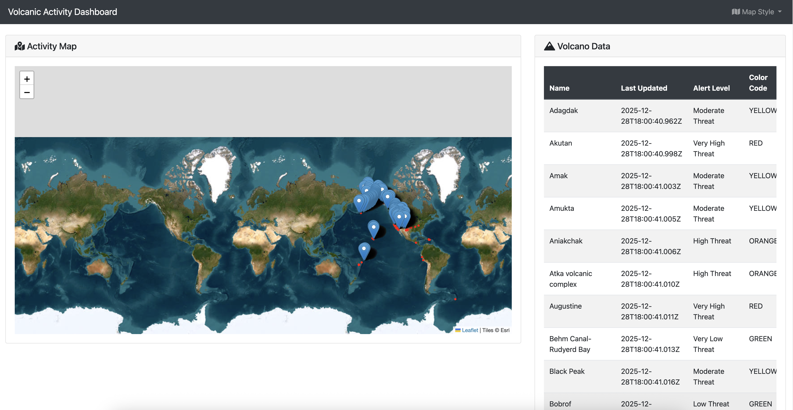
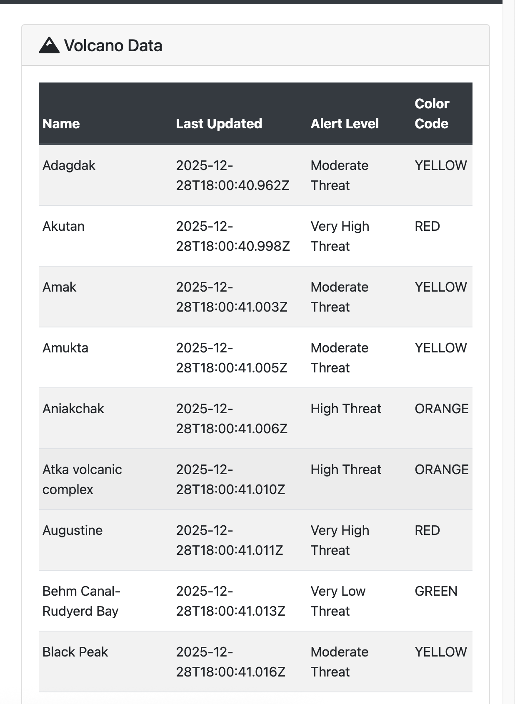

## **Introduction**
The capacity to monitor geological events in real-time is a critical component of modern public safety and environmental management strategies. For events such as volcanic eruptions, where precursors like increased seismic activity can offer vital windows for action, the ability to ingest, process, and visualize data with minimal latency is paramount. An effective monitoring system is foundational for reliable early-warning protocols and efficient disaster response.

This technical guide details the development of a high-performance volcanic activity monitoring system. The solution leverages [GridDB Cloud](https://www.global.toshiba/ww/products-solutions/ai-iot/griddb/product/griddb-cloud.html), a database optimized for time-series data, in conjunction with the **Spring Boot** framework for a robust backend architecture. The system ingests live data from USGS APIs, persists it to GridDB, and presents the information on a dynamic, map-centric web interface, providing a powerful and practical monitoring tool.

## Database Selection: The Case for GridDB

The choice of database is a primary architectural decision in any data-intensive application. For this monitoring system, which inherently deals with time-indexed event data, GridDB presents several key advantages.

* **Optimized for Time-Series Workloads:** GridDB is purpose-built for IoT and time-series data. Its in-memory-oriented architecture storage model are designed for high-throughput ingestion and querying, ensuring the application can handle a continuous stream of data without performance bottlenecks.
* **A-Data-Model-for-Time-Series:** The container-based data model is a natural fit. `VolcanoData` and `SeismicData` can be logically separated into their own containers, using the event timestamp as the row key. This schema facilitates efficient time-based querying and data lifecycle management.
* **Flexible API Access:** While offering native Java clients for maximum performance, GridDB also provides a comprehensive REST API. This grants developers language-agnostic access and allows a standard Spring Boot application to integrate seamlessly using conventional tools like `RestTemplate`, avoiding the need for additional complex dependencies.

## System Architecture and Data Flow

The application employs a layered, unidirectional data flow architecture. This design promotes modularity, simplifies debugging, and enhances scalability.

1. **Scheduled Ingestion:** The data pipeline is initiated by `DataSchedulerService`, a Spring-scheduled bean that executes at a defined interval.
2. **External Data Sourcing:** This scheduler invokes `VolcanicDataService`, which acts as a client to the public USGS APIs, handling HTTP request execution and response reception.
3. **Data Parsing and Transformation:** The raw JSON responses are parsed using the Jackson `ObjectMapper` into a `JsonNode` tree. Specific fields are then extracted and mapped into strongly-typed Java domain models (`VolcanoData`, `SeismicData`). This practice ensures data integrity and insulates the application from changes in the external API's structure.
4. **Data Persistence:** The curated Java objects are passed to `GridDBService`, which functions as an adapter to the GridDB REST API. It transforms the application data into the JSON structure required by GridDB's bulk insertion endpoint and manages authentication.
5. **Presentation Layer:** User interaction begins with a request to the `DashboardController`. This controller retrieves the latest data from GridDB via the `GridDBService` and forwards it to the Thymeleaf view layer.
6. **Dynamic Rendering:** The Thymeleaf engine processes the `dashboard.html` template, rendering the data into HTML tables and embedding the geospatial data directly into client-side JavaScript variables. The browser then executes this script, using Leaflet.js to render the final interactive map visualization.

## Backend Implementation: The Data Pipeline

The backend constitutes the core data processing engine of the application.

### Project Configuration (`application.properties`)

The `application.properties` file provides the foundational configuration for the application, most importantly defining the connection to GridDB.

```properties
# GridDB REST API Endpoint
griddb.rest.url=https://your-griddb-cloud-instance.griddb.com:443/griddb/v2/your-cluster-name/dbs/your-database-name

# GridDB Basic Authentication Credentials
griddb.api.key=YOUR_GRIDDB_BASIC_AUTH_KEY

# Spring Boot Actuator and Server Port
management.endpoints.web.exposure.include=*
server.port=8081
```

The `griddb.api.key` property facilitates **HTTP Basic Authentication**. This value must be a Base64 encoded string of the GridDB `username:password`. For instance, `admin:admin` is encoded as `YWRtaW46YWRtaW4=`.

### The GridDB Service Layer (`GridDBService`)

This service is the most critical integration component, managing all communication with the GridDB REST API.

**Authentication:** API access requires that every request be authenticated. The `createHeaders` method isolates this responsibility, programmatically constructing the necessary `Authorization` header for each outgoing request.

```java
private HttpHeaders createHeaders() {
    HttpHeaders headers = new HttpHeaders();
    headers.set("Authorization", "Basic " + griddbApiKey);
    headers.set("Content-Type", "application/json");
    return headers;
}
```

**Data Transformation for Ingestion:** To maximize efficiency, the GridDB REST API supports bulk row insertion via a JSON array of arrays. The `putVolcanoData` method performs this data transformation, converting a `List<VolcanoData>` into the required payload format before serialization and transmission. This approach is significantly more performant than sending individual requests for each row.

```java
// Inside GridDBService.java
public void putVolcanoData(List<VolcanoData> volcanoData) {
    List<List<Object>> payload = new ArrayList<>();
    for (VolcanoData data : volcanoData) {
        List<Object> row = new ArrayList<>();
        row.add(ISO_INSTANT_FORMATTER.format(data.timestamp));
        row.add(data.name);
        // ... other fields are added in the correct order ...
        payload.add(row);
    }
    // ... payload is serialized and sent to the /rows endpoint ...
}
```

Of particular note is the use of a custom `DateTimeFormatter`. Consistent timestamp formatting is critical for time-series integrity. This formatter ensures that Java `Instant` objects are always serialized to a standardized ISO-8601 string that GridDB can parse into its native `TIMESTAMP` data type.

## Frontend Implementation: The User Interface

The utility of a powerful backend is contingent upon a clear and intuitive data presentation layer. The frontend is engineered to provide just that.

### A Strategic Selection of Technologies

* **Thymeleaf:** Chosen for its "natural templating" feature, which allows templates to be rendered as valid, static HTML during development. This improves the development workflow and decouples the view's design from its server-side processing.
* **Bootstrap:** Provides a robust CSS framework for a responsive, mobile-first design, enabling the use of polished UI components like `card` and `navbar` with minimal custom styling.
* **Leaflet.js:** A lightweight and powerful open-source library for creating the interactive map, which is central to visualizing the geospatial data.

### Functional Interactivity

The map style switcher is a key interactive feature, allowing users to select a base layer that provides the most relevant context for their analysis, whether it be satellite imagery or a street map. This is implemented using a clean JavaScript pattern that manages a collection of tile layer providers.

```javascript
var tileLayers = {
    street: L.tileLayer('...OpenStreetMap URL...', { ... }),
    satellite: L.tileLayer('...Esri Imagery URL...', { ... }),
    terrain: L.tileLayer('...OpenTopoMap URL...', { ... })
};

function setMapStyle(style) {
    if (currentTileLayer) {
        map.removeLayer(currentTileLayer);
    }
    currentTileLayer = tileLayers[style];
    currentTileLayer.addTo(map);
}

// Set the initial map style on page load
setMapStyle('street');
```

This architecture, combining a well-engineered backend with a thoughtfully designed frontend, results in a highly functional and insightful application.

## Running the Application and Accessing the Dashboard

To run the Spring Boot application and access the volcanic activity dashboard, follow these steps:

1. **Ensure Prerequisites are Met:**
   
   * **Java Development Kit (JDK) 17 or higher:** The application is built with Java.
   * **Maven:** Used for building the project and managing dependencies.
   * **GridDB Cloud Instance:** Ensure your GridDB Cloud instance is running and you have the necessary API key and endpoint URL configured in `src/main/resources/application.properties`.

2. **Build the Application:**
   Navigate to the `my-griddb-app` directory in your terminal and build the project using Maven:
   
   ```bash
   cd my-griddb-app
   mvn clean install
   ```
   
   This command compiles the code, runs tests, and packages the application into a JAR file.

3. **Run the Application:**
   After a successful build, you can run the Spring Boot application from the `my-griddb-app` directory:
   
   ```bash
   java -jar target/my-griddb-app-1.0-SNAPSHOT.jar
   ```
   
   Alternatively, you can run it directly using Maven Spring Boot plugin:
   
   ```bash
   mvn spring-boot:run
   ```
   
   The application will start, and you will see logs indicating that the embedded Tomcat server has started on the configured port (default is 8081, as set in `application.properties`).

4. **Access the Dashboard:**
   Open your web browser and navigate to the application's dashboard URL. By default, this will be:
   
   ```
   http://localhost:8081/dashboard
   ```
   
   You should see the interactive volcanic activity dashboard displaying the latest data fetched from GridDB.
   
   
   _Interactive map view of volcanic activity._
   
   
   _Detailed table view of volcanic data._

## Conclusion

This project serves as a comprehensive technical blueprint for building high-performance, real-time monitoring systems. The combination of GridDB for data persistence and Spring Boot for backend logic proves to be a powerful stack for such applications. The final dashboard effectively ingests, stores, and visualizes critical geological data.

The modular design of the application provides a solid foundation for future enhancements, such as:

* **Automated Alerting:** A service could be implemented to analyze incoming data for predefined critical patterns and trigger automated alerts.
* **Historical Data Analysis:** The user interface could be extended to support querying and visualizing historical data, enabling trend analysis.
* **Expanded Data Integration:** The system could be enhanced by integrating additional data sources, such as weather feeds or gas emission data, to create a more holistic monitoring solution.

